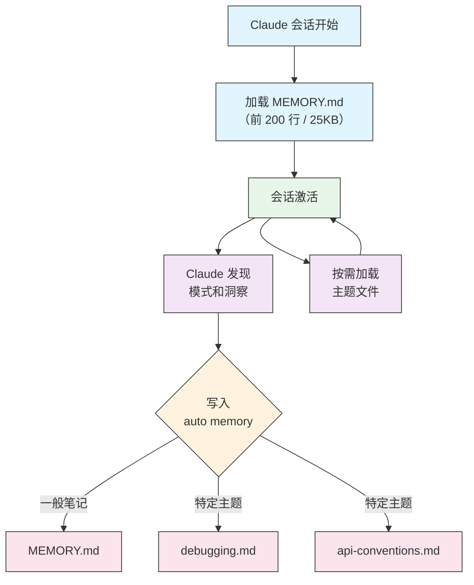

<picture>
  <source media="(prefers-color-scheme: dark)" srcset="../../resources/logos/claude-howto-logo-dark.svg">
  
</picture>

# Memory 指南

## 概览

Memory 让 Claude Code 在不同会话之间保留上下文。你可以把团队规范、项目规则、个人偏好和目录级约束写进 `CLAUDE.md`，让 Claude 在合适的时候自动加载。

## Memory 命令速查

| 命令 | 作用 |
|------|------|
| `/init` | 初始化项目级 `CLAUDE.md` |
| `/memory` | 打开并编辑记忆文件 |
| `#` | 快速把当前规则写入 memory |

## 快速上手：初始化 Memory

### 使用 `/init`

在项目目录中运行：

```bash
/init
```

Claude 会根据当前项目生成一个 `CLAUDE.md`，通常包含类似如下结构：

```md
# 项目配置
## 项目概览
## 开发规范
```

### 使用 `#` 快速更新记忆

当你想把一句规则写入 memory 时，可以直接在输入前加 `#`：

```text
# 这个项目始终使用 TypeScript 严格模式
# 优先使用 async/await，而不是 promise 链
# 每次提交前都运行 npm test
# 文件名统一使用 kebab-case
```

这会把规则加入当前会话能感知到的记忆中。

### 使用 `/memory`

`/memory` 会打开记忆编辑器，让你在不同范围之间切换：

1. 受管策略记忆
2. 项目记忆（`./CLAUDE.md`）
3. 用户记忆（`~/.claude/CLAUDE.md`）
4. 本地项目记忆

适合你把长期规则、项目规范和个人偏好分层管理。

## Memory 架构

Claude Code 的记忆系统通常有以下层级：

| 层级 | 作用范围 | 典型内容 |
|------|----------|----------|
| 受管策略 | 组织级 | 合规、安全、统一流程 |
| 项目记忆 | 单个项目 | 架构、编码标准、工作流 |
| 目录记忆 | 子目录 | 模块约束、局部规范 |
| 用户记忆 | 单个用户 | 个人偏好、默认设置 |

## 记忆层级

Claude 会按更接近当前上下文的规则优先使用更具体的 memory。一般来说：

- 组织级规则优先于普通偏好
- 项目规则优先于个人偏好
- 目录级规则优先于项目级通用规则

## 排除规则

如果某些 `CLAUDE.md` 不应该被自动加载，可以通过 `claudeMdExcludes` 之类的设置排除。

## 配置文件层级

项目设置、用户设置和企业托管设置会共同影响 memory 的加载方式。你可以把它理解为：

1. 组织策略
2. 项目设置
3. 本地设置
4. 临时会话输入

🆕 **详细的设置文件层级（五级）：**

| 级别 | 位置 | 作用范围 |
|------|------|---------|
| 1（最高） | 托管策略（系统级） | 组织范围强制执行 |
| 2 | `managed-settings.d/`（v2.1.83+） | 模块化策略文件，按字母顺序合并 |
| 3 | `.claude/settings.local.json` | 本地覆盖（git 忽略） |
| 4 | `.claude/settings.json` | 项目级（提交到 git） |
| 5（最低） | `~/.claude/settings.json` | 用户偏好 |

🆕 **平台特定配置（v2.1.51+）：**

设置还可以通过以下方式配置：
- **macOS**：属性列表（plist）文件
- **Windows**：Windows 注册表

这些平台原生机制与 JSON 设置文件一起读取，并遵循相同的优先级规则。

🆕 **注意（v2.1.119）**：`/config` 更改现在会持久化到 `~/.claude/settings.json`。通过 `/config` 写入的值参与上述正常的策略/本地/项目优先级链 — 它们不再是仅会话的。使用 `/config` 进行交互式编辑，直接编辑 `settings.json` 文件进行脚本化或托管配置。🆕

### 🆕 保留和清理设置 🆕

| 设置 | 类型 | 默认值 | 描述 |
|------|------|--------|------|
| `cleanupPeriodDays` | 整数（天） | 30 | 磁盘工件的保留窗口。**自 v2.1.117 起**，它适用于以下四种：checkpoints（`~/.claude/checkpoints/`）、tasks（`~/.claude/tasks/`）、shell-snapshots（`~/.claude/shell-snapshots/`）和 backups（`~/.claude/backups/`）。超过窗口的文件在启动时会被清理。 |

```jsonc
// ~/.claude/settings.json
{
  "cleanupPeriodDays": 14
}
```

### 🆕 归因、语音和 PR URL 设置 🆕

| 设置 | 类型 | 描述 |
|------|------|------|
| `attribution.commit` | 布尔值 | 在 Claude 创建的提交中添加 `Co-Authored-By: Claude` 尾注。替代已弃用的 `includeCoAuthoredBy` 标志。 |
| `attribution.pr` | 布尔值 | 在 PR 描述中添加 Claude 归因。替代已弃用的 `includeCoAuthoredBy` 标志（用于 PR）。 |
| `voice.enabled` | 布尔值 | 启用按住说话语音听写（`/voice`）。替代已弃用的 `voiceEnabled` 标志。 |
| `prUrlTemplate` | 字符串 | **v2.1.119 新增。** PR 徽章页脚的自定义 URL 模板；适用于 GitLab、Bitbucket 或内部代码审查平台。支持 `{{owner}}`、`{{repo}}` 和 `{{number}}` 占位符。 |

```jsonc
// ~/.claude/settings.json
{
  "attribution": {
    "commit": false,
    "pr": true
  },
  "voice": {
    "enabled": true
  },
  "prUrlTemplate": "https://gitlab.internal/{{owner}}/{{repo}}/-/merge_requests/{{number}}"
}
```

🆕 **已弃用的设置名称：**

以下旧设置键仍然有效但已弃用。请优先使用上述替代方案。

| 已弃用的键 | 替代方案 | 备注 |
|-----------|---------|------|
| `includeCoAuthoredBy` | `attribution.commit` / `attribution.pr` | 旧的单个标志被拆分为单独的提交和 PR 开关。使用旧版安装的用户可以保留旧键；新项目应使用嵌套形式。 |
| `voiceEnabled` | `voice.enabled` | 归入 `voice` 命名空间，与未来语音相关选项一起。 |

## 模块化规则系统

Memory 不一定要写成一个巨大文件。你可以把规则拆成多个目录文件，再按路径组织。

### 通过 YAML frontmatter 设置路径规则

```md
---
description: API development rules
---

# API Development Rules
```

### 子目录与符号链接

你可以用子目录和 symlink 把局部规则复用到多个项目区域。

## Memory 位置表

🆕 **详细的 Memory 位置表：** 🆕

| 位置 | 作用范围 | 优先级 | 共享 | 访问 | 最适合 |
|------|---------|--------|------|------|--------|
| `/Library/Application Support/ClaudeCode/CLAUDE.md`（macOS） | 托管策略 | 1（最高） | 组织 | 系统 | 公司范围策略 |
| `/etc/claude-code/CLAUDE.md`（Linux/WSL） | 托管策略 | 1（最高） | 组织 | 系统 | 组织标准 |
| `C:\Program Files\ClaudeCode\CLAUDE.md`（Windows） | 托管策略 | 1（最高） | 组织 | 系统 | 企业指南 |
| `managed-settings.d/*.md`（策略旁边） | 托管 Drop-ins | 1.5 | 组织 | 系统 | 模块化策略文件（v2.1.83+） |
| `./CLAUDE.md` 或 `./.claude/CLAUDE.md` | 项目记忆 | 2 | 团队 | Git | 团队标准、共享架构 |
| `./.claude/rules/*.md` | 项目规则 | 3 | 团队 | Git | 路径特定、模块化规则 |
| `~/.claude/CLAUDE.md` | 用户记忆 | 4 | 个人 | 文件系统 | 个人偏好（所有项目） |
| `~/.claude/rules/*.md` | 用户规则 | 5 | 个人 | 文件系统 | 个人规则（所有项目） |
| `./CLAUDE.local.md` | 项目本地 | 6 | 个人 | Git（忽略） | 个人项目特定偏好 |
| `~/.claude/projects/<project>/memory/` | Auto Memory | 7（最低） | 个人 | 文件系统 | Claude 的自动笔记和学习 |

## Memory 更新生命周期

一般流程是：

1. 创建或编辑 `CLAUDE.md`
2. Claude 重新加载
3. 新规则在后续会话中生效

## Auto Memory

Auto memory 让 Claude 根据当前目录自动寻找并加载合适的记忆文件。

### 工作方式

Claude 会根据当前工作目录、父目录和已配置路径，逐层查找相关 memory。

🆕 **Auto Memory 架构图：** 🆕



🆕 **Auto Memory 目录结构：** 🆕

```text
~/.claude/projects/<project>/memory/
├── MEMORY.md              # 入口文件（启动时加载前 200 行 / 25KB）
├── debugging.md           # 主题文件（按需加载）
├── api-conventions.md     # 主题文件（按需加载）
└── testing-patterns.md    # 主题文件（按需加载）
```

### 目录结构

```text
project/
├── CLAUDE.md
├── src/
│   ├── CLAUDE.md
│   └── api/
│       └── CLAUDE.md
```

### 版本要求

某些 auto memory 行为依赖较新的 Claude Code 版本。

### 自定义 auto memory 目录

如果默认目录不适合你的项目，可以在设置中指定新的 memory 路径。

### worktree 和仓库共享

在 worktree、monorepo 或多人协作场景中，auto memory 可以帮助保持规则一致。

### Subagent 记忆

Subagents 也可以拥有自己的记忆范围，用于在各自职责内保持一致性。

### 控制 auto memory

```bash
# 当前会话禁用 auto memory

# 显式开启 auto memory
```

## 通过 `--add-dir` 添加额外目录

你可以用 `--add-dir` 把额外目录也加入 Claude 的可见范围，适合多目录协作。

## 实战示例

### 示例 1：项目记忆结构

```md
# 项目配置
## 项目概览
## 架构
## 开发规范
### 代码风格
### 命名约定
### Git 工作流
### 测试要求
### API 规范
### 数据库
### 部署
## 常用命令
## 团队联系人
## 已知问题与解决办法
## 相关项目
```

### 示例 2：目录级记忆

```md
# API 模块规范
## API 专属规范
### 请求校验
### 身份验证
### 响应格式
### 分页
### 限流
### 缓存
```

### 示例 3：个人记忆

```md
# 我的开发偏好
## 关于我
## 代码偏好
### 错误处理
### 注释
### 测试
### 架构
## 调试偏好
## 沟通方式
## 项目组织
## 工具链
```

### 示例 4：会话中更新记忆

两种常见方式：

1. 直接提要求，让 Claude 把规则写进 memory
2. 使用 `# new rule into memory` 这种模式追加规则

## 最佳实践

### 应该做的

- 用项目记忆保存团队标准
- 用目录记忆保存局部差异
- 先写简洁规则，再逐步补充
- 把可重复内容写进 `CLAUDE.md`

### 不应该做的

- 不要把 README 整份复制进 `CLAUDE.md`
- 不要把明显属于代码的实现细节硬塞进 memory
- 不要让 memory 变成垃圾桶

### 记忆管理建议

- 优先引用已有文档，而不是重复粘贴
- 只保留真正影响 Claude 行为的信息
- 定期整理过期或冲突的规则

## 安装说明

### 设置项目记忆

#### 方法 1：使用 `/init`（推荐）

```bash
/init
```

#### 方法 2：手动创建

```bash
cp project-CLAUDE.md CLAUDE.md
```

#### 方法 3：快速更新

```text
# Use semantic versioning for all releases
# Always run tests before committing
# Prefer composition over inheritance
```

### 设置个人记忆

```bash
cp personal-CLAUDE.md ~/.claude/CLAUDE.md
```

### 设置目录记忆

```bash
cp directory-api-CLAUDE.md src/api/CLAUDE.md
```

### 验证安装

- 重新打开 Claude Code 会话
- 检查 `CLAUDE.md` 是否被自动加载
- 用一条明显会受 memory 影响的提示词测试

## 官方文档

如果你想看更详细的行为定义、兼容性和最新限制，建议参考 Claude Code 官方 memory 文档。

## 相关概念

- [Slash Commands 中文参考](../01-slash-commands/README.md)
- [Skills 中文指南](../03-skills/README.md)
- [Subagents 中文参考](../04-subagents/README.md)
- [Advanced Features 中文指南](../09-advanced-features/README.md)

---

**最后更新**: ✅ 2026 年 6 月 ✅
**Claude Code 版本**: ✅ 2.1.160 ✅
**兼容模型**: ✅ Claude Sonnet 4.6、Claude Opus 4.8、Claude Haiku 4.5 ✅
